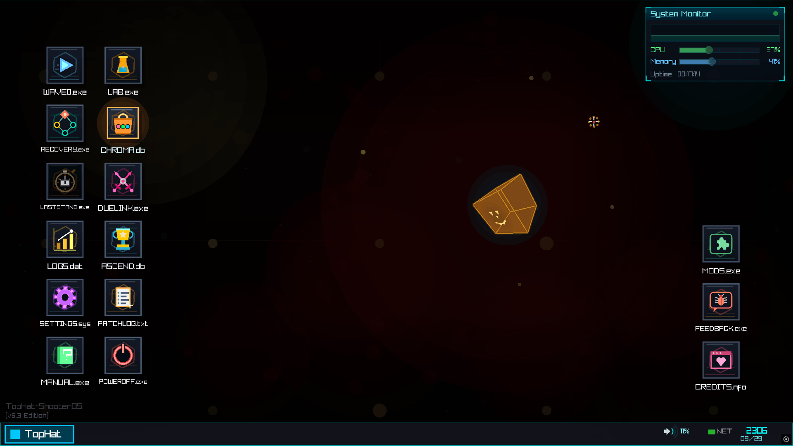
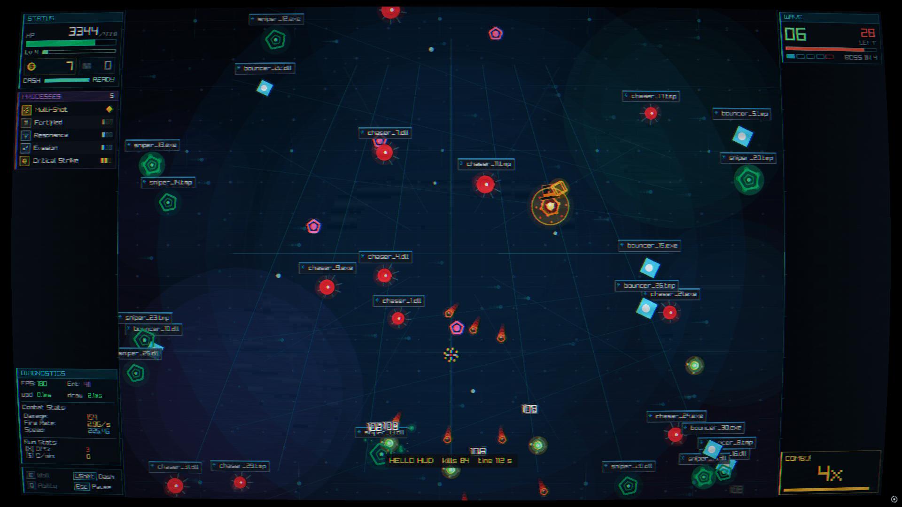

# 🎩 TopHat-ShooterOS


TopHat-ShooterOS is a fast, chaotic bullet-heaven written in Nim with Raylib, where the
whole game is a desktop operating system. You play a lone process defending the TOPHAT
kernel from a hostile takeover. The menus are desktop apps, the enemies are rogue processes
and the bosses are hijacked system services.

## Features

- **The whole game is a desktop OS.** Start runs from `WAVE0.exe`, buy cosmetics in
  `CHROMA.db`, read the manual in a terminal (`MANUAL.exe`), track records in `LOGS.dat`,
  or change the rules with `MODS.exe`.
- **Five ways to play:** a 60-wave campaign, the *Deep Recovery* roguelite, a 20-minute
  *Time Survival* horde mode, online PvP for 2-16 players, and a sandbox.
- **Lots of content:** 88 power-ups, 28 enemy types and 21 bosses, split into separate
  rosters for the wave, survival and roguelite modes.
- **Build variety:** elemental families (fire, frost, poison, lightning, wind, blood,
  arcane) with auras, orbs and bullet effects, masteries and legendary [Q] abilities.
  Add walls, turrets, a dash and a rerollable draft on every level-up.
- **Game feel:** hit-stop, screen shake, a combo meter, damage numbers that fan out,
  and slow motion on boss kills. Screen shake and damage numbers can be turned down in Settings.
- **Four difficulties:** Easy, Medium, Hard and Nightmare, one profile each. Restore
  points let you continue after a death. How many you get depends on the difficulty,
  and Nightmare has none.
- **Mods:** Lua 5.5 scripts, textures, animated GIFs, 3D models and shaders, all run in
  a sandbox. Nine example mods ship with the game.
- **Progression:** Data Shards and Cores from the three PvE modes, 39 advancements, cosmetic skins
  for your player, bullets, particles, the desktop cube and the wallpaper, plus story
  cinematics and a lore archive.
- **Everything else:** full controller support, English and Spanish, Discord Rich
  Presence, and a built-in tutorial (`ORIENTATION.EXE`).

<p align="center">
  
</p>

## Game modes

| Mode | Desktop app | What it is |
|---|---|---|
| **Waves** | `WAVE0.exe` | The campaign: 60 waves, with a boss every 5 waves (12 in all). Earn XP to draft power-ups and spend credits in the shop before each boss. After wave 60 you can keep going in endless mode. |
| **Deep Recovery** | `RECOVERY.exe` | Roguelite. Pick a path of folders through 4 sectors to reach each sector's SERVICE boss. Each door shows its reward (power-ups, patches, credits, repairs, shop stalls or an elite fight). 16 patches, 3 starting profiles and Heat levels to earn. *Unlocks when you beat the wave 20 boss.* |
| **Time Survival** | `LASTSTAND.exe` | A 20:00 horde run in four phases (Boot, Runtime, Overload, Kernel Panic). Each phase ends with a boss, followed by optional Overtime. There's no shop: System Events, elites and bosses drop Data Caches instead. *Unlocks when you win a Deep Recovery run.* |
| **PvP** | `DUELINK.exe` | Online arena for 2-16 players over UDP, free-for-all or teams. The host runs the match. Includes arena packages, kill streaks, a process table and instant rematches. |
| **Sandbox** | `LAB.exe` | Spawn any enemy or boss, try out power-ups, and enter a 3D boss fight. |

## Download & play

Prebuilt builds are published on the
[Releases page](https://github.com/Paycei/TopHat-Shooter/releases):

- **Windows installer**: `TopHatShooterOS-Installer_<version>.exe`
- **Windows portable**: `TopHatShooterOS-PORTABLE.zip`, unzip and run
- **Linux (x86_64)**: `TopHatShooterOS-linux-x86_64.tar.gz`

The game makes its sounds and music on first launch, so there are no asset files to install.

### Controls

| Action | Keyboard & mouse | Controller |
|---|---|---|
| Move | `W` `A` `S` `D` | Left stick / D-pad |
| Aim & shoot | Mouse, hold left click or `Space` | Right stick, `RT` |
| Dash | `Left Shift` | `LT` |
| Place wall | `E` (hold to preview) | `X` / `□` |
| Legendary ability | `Q` | `Y` / `△` |
| Pause | `Esc` | `Start` |
| Fullscreen | `F11` | |

You can rebind every gameplay action in **SETTINGS.sys > Controls**.

### Save data

Each profile has its own folder:

- **Windows:** `%APPDATA%\.tophat\shooter\profiles\<slot>\`
- **Linux:** `~/.local/share/.tophat/shooter/profiles/<slot>/`

Debug builds save to a separate `debug/` subfolder, so testing never touches your real progress.

### Multiplayer

PvP is a host-authoritative UDP match for 2-16 players. It is designed for players on
the same local network.

1. Open **DUELINK.exe** on the desktop and choose **HOST GAME**.
2. Enter a nickname, choose the maximum number of players, and optionally enable teams
   or adjust the match settings. Choose **START HOSTING**.
3. Share the host's displayed **Local IP** and **Port** with the other players. The
   default port is `7777`.
4. On each other computer, open **DUELINK.exe**, choose **JOIN GAME**, enter a nickname,
   the host's IP address, and the same port, then choose **CONNECT**.
5. When everyone is listed in the lobby, the host chooses **START GAME**. A minimum of
   two players is required.

All players must use compatible game builds and the same loaded mod set. If a player
cannot connect, check the host IP and UDP port, make sure the game is allowed through
the firewall, and confirm that everyone is on the same network.

## Modding

<p align="center">
  
</p>

Open **MODS.exe** on the desktop, press **Install Examples**, tick a mod and press
**Apply & Reload**. Mods are written in **Lua 5.5** (the official implementation,
compiled into the game) and can:

- add game modes, enemies, bosses and power-ups, or change the rules of the existing modes
- reskin the player, enemies, bullets, icons, the wallpaper and the desktop cube with
  PNGs, animated GIFs or 3D models (glTF/GLB, OBJ, IQM, VOX, M3D)
- replace built-in behaviour (movement, dash, shooting, pickups, the shop, level-ups,
  enemy AI, boss attacks), hide the HUD and draw their own, or add screen shaders
- add their own apps to MODS.exe

Mods run in a sandbox: they can't touch your files or the network, and a runaway
script is stopped instead of freezing the game. Runs with mods loaded keep their own
saves and earn no permanent rewards, unless every loaded mod
opts out with `"disableAchievements": false` (for mods that only change looks).

The included examples are *Hello HUD*, *Glass Cannon*, *House Rules*, *Survival Tweaks*,
*Bouncer*, *Overclock Boss*, *Neon Pack*, *Retro CRT* and *Model Pack*. They live in
[`mods-sdk/examples/`](mods-sdk/examples), and the full API reference is in
[`mods-sdk/MODDING.md`](mods-sdk/MODDING.md).

## Building from source

**Requirements:** [Nim](https://nim-lang.org) 2.2.12 or newer with Nimble. Dependencies
(`flatty`, `supersnappy`) come from `nimble install`. Raylib and Lua are compiled into the
executable: Lua ships with the source, and raylib comes with its Nim bindings from the
`vendor/naylib` git submodule, a maintained fork of
[naylib](https://github.com/planetis-m/naylib) at [Paycei/naylib](https://github.com/Paycei/naylib).
Windows release builds need the Visual C++ Build Tools.
Linux builds need the usual Raylib system headers (X11 and OpenGL).

```bash
git clone --recursive https://github.com/Paycei/TopHat-Shooter.git
cd TopHat-Shooter
nimble install        # fetch dependencies
```

Already cloned without `--recursive`, or pulled a commit that moves the submodule to a newer
naylib? Run `nimble submodules` (or `git submodule update --init`). The GitHub
"Download ZIP" and the Releases page's source archives leave the submodule out, so build
from a clone.

| Command | Result |
|---|---|
| `nimble debug` | Build and run `TopHatShooterOS-debug.exe` (debug build, cheat menu enabled) |
| `nimble WinRelease` | Speed-optimized Windows build (MSVC) → `TopHatShooterOS.exe` |
| `nimble WinReleaseMin` | Size-optimized Windows build → `TopHatShooterOS.exe` |
| `nimble LinuxRelease` | Optimized Linux build → `TopHatShooterOS-linux-x86_64` |
| `nimble ship` | All three release artifacts plus `SHA256SUMS.txt` in `ship/` (see [`tools/ship.ps1`](tools/ship.ps1)) |
| `nimble submodules` | Check out `vendor/naylib` at the commit the game records (e.g. after a `git pull`) |

`nimble ship` is the release pipeline and has extra requirements: PowerShell 7,
niminst, Inno Setup, and a WSL distro with Nim for the Linux build. The script checks
for all of them before it compiles anything.

### Checks

Most of the checking is done by the compiler. Exhaustive `case` statements over the
game's enums make it refuse to build until new content is handled everywhere.

```bash
nim check --mm:orc src/main.nim                # fast type-check, no binary
nim r --mm:orc tests/test_spatial_grid.nim     # enemy spatial-grid queries
nim r --mm:orc tests/test_mod_lua.nim          # mod runtime: sandbox, limits, errors
```

### Where things live

- `src/main.nim`: window, frame loop and the game-state machine
- `src/game.nim` + `src/game/`: gameplay core (combat, bullets, bosses, shooting, ...)
- `src/types.nim`: the data model and every enum
- `src/survival.nim`, `src/roguelite.nim`, `src/dungeon.nim`, `src/pvp_game.nim`,
  `src/sandbox.nim`: the individual modes
- `src/ui/`: the OS desktop, window manager, app windows and HUD
- `src/modding/`: the Lua runtime and mod API
- `src/localization.nim`: English and Spanish strings

**AI-written technical wiki:**

[](https://deepwiki.com/Paycei/TopHat-Shooter)

## Contributing

Issues and pull requests are welcome. To report a bug from inside the game, open
**FEEDBACK.exe** on the desktop. It fills in a GitHub issue for you, with system info attached.

## Support the project

TopHat-ShooterOS is free and open source. If you enjoy it and want to help fund
more content, you can buy me a coffee.

[](https://ko-fi.com/paycei)
[](https://buymeacoffee.com/paycei)

Support is entirely optional and never gates any feature of the game.

## License

Apache 2.0, see [LICENSE](LICENSE). Lua 5.5 is vendored under the MIT license
(see [`vendor/lua/LICENSE`](vendor/lua/LICENSE)).
